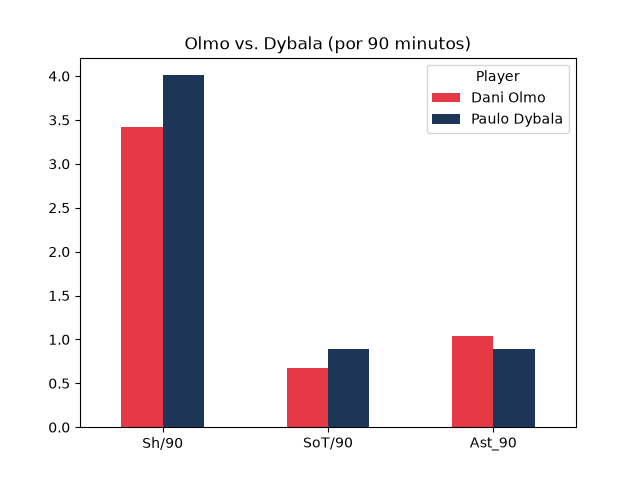

# Buscador de jugadores parecidos

Proyecto en Python que busca los jugadores más parecidos a uno dado, usando todas las estadísticas numéricas de las cinco grandes ligas europeas. Tú eliges el jugador y la posición con la que compararlo.

## Qué hace
- Convierte los totales a "por 90 minutos" para comparar con justicia a jugadores con distintos minutos.
- Usa todas las métricas numéricas disponibles, normalizadas con `StandardScaler`.
- Compara al jugador elegido con los de la posición que indiques (`FW`, `MF` o `DF`) mediante un modelo de vecinos más cercanos (scikit-learn).
- Genera gráficos comparativos entre dos jugadores (matplotlib).

## Datos
Dataset "Football Players Stats (2026-2027)" de Kaggle, con datos de FBref, descargado el 3 de octubre de 2026. No se incluye en este repositorio: descárgalo y guárdalo en la carpeta del proyecto como `players_data_light-2026_2027.csv`.

## Cómo ejecutarlo
1. Instala las librerías: `pip install -r requirements.txt`
2. Descarga el CSV (ver sección Datos) y guárdalo en la carpeta del proyecto.
3. Lanza la web: `python -m streamlit run app.py`
4. Elige el jugador, la posición con la que compararlo y el mínimo de partidos de 90 minutos.

También puedes usar la versión de terminal con `python parecidos.py`.

## Estructura
- `parecidos.py`: buscador principal.
- `grafico.py`: gráficos comparativos entre dos jugadores.
- `pruebas/`: scripts de los primeros pasos del aprendizaje.
- `imagenes/`: gráficos generados.
- `app.py`: web con Streamlit (selector de jugador, tabla de parecidos y gráfico comparativo).

## Limitaciones
- Solo se incluyen jugadores con al menos 4 partidos de 90 minutos, y al inicio de temporada las métricas son muy inestables.
- El modelo solo ve números: no conoce el estilo de juego, la calidad de los rivales ni el rol táctico. Un "parecido" estadístico no significa que jueguen igual.
- La etiqueta `MF` agrupa roles muy distintos (pivotes, interiores, mediapuntas).

## Autor
Martin ([MartinPeral](https://github.com/MartinPeral))